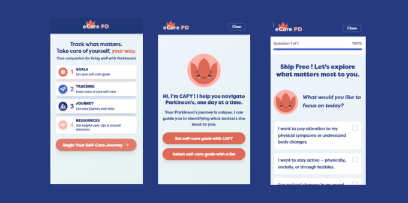

---

##### Download

- [Paper](https://dl.eusset.eu/server/api/core/bitstreams/d50e86ce-aef0-4e94-b3bd-d18e26d95743/content)

---

##### Abstract

The aim of this paper is to explore the potential of a digital health technology (eCARE-PDTM) designed to support self-care and assist individuals with Parkinson's disease (PD) in identifying their care needs and establishing personalized goals to enhance self-care. The efficacy of self-care in PD depends on personalized goal setting; however, people with PD (PwPs) struggle to identify care priorities due to fluctuating and unpredictable symptoms. Based on the findings of a usage diary study, we will explore the enhancement of a self-care technology with a dialogue interface to facilitate more personalized goal setting. The usage diary study revealed that PwPs experience uncertainty when selecting care priorities from a predefined list, and they expressed a need for a system that translates their personal experiences into actionable goals. The integration of a dialogue interface within eCARE-PDTM is proposed, engaging users in interactive dialogues that stimulate reflection on recent symptoms and daily challenges, facilitating a collaborative definition of personalized self-care objectives. This direction is further explored through a dialogue interface (CAFY), a prototype designed to help patients articulate their care priorities and translate them into meaningful, actionable goals. CAFY will serve as a design probe in upcoming participatory design workshops to inform the next cycle of co-design, which aims to improve eCARE-PDTM by integrating an AI-based conversational recommendation system.

##### Figure 6: CAFY, a prototype designed to help patients articulate their care priorities

---

##### Citation

Grosjean, Sylvie; Mujica, Janette; Saadeh, Nadim; Grimes, David; Mestre, Tiago (2025). _“What Should I Focus on Today?” Co-Designing a Goal-Setting Dialogue Tool for Parkinson’s Self-Care_. Proceedings of the 10th International Conference on Infrastructures for Healthcare.

##### Related material

- [eCare PD - CAFY (Care Assistant For You) - Prototype Website](https://janettemujica.github.io/ecare-pd_prototype/)
- [eCare-PD - CAFY - GitHub Prototype Repository](https://github.com/JanetteMujica/ecare-pd_prototype)
- [Conference Paper Website](https://dl.eusset.eu/items/266f8547-afe5-4f7b-a6e7-58707334a89e)
